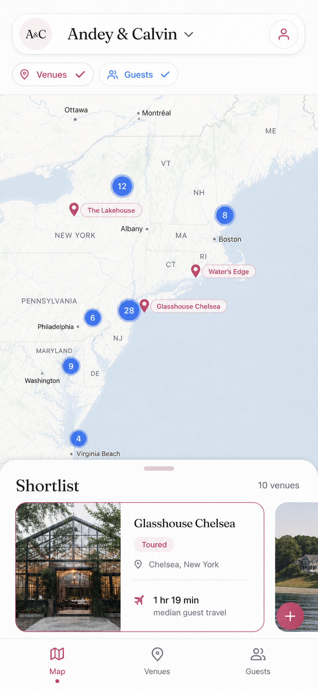
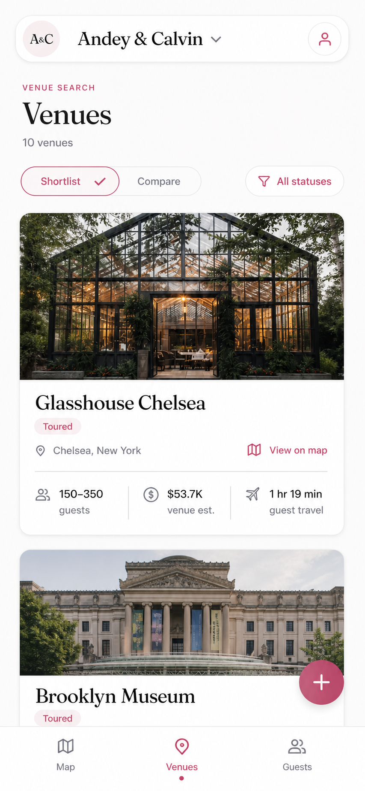
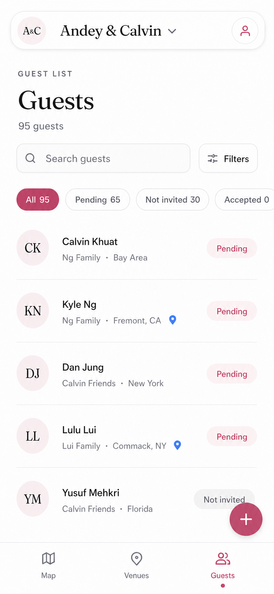

# Vowbase iOS MVP UX Specification

Status: Approved visual direction; implementation not started
Date: July 28, 2026
Platform: Native SwiftUI, iOS 18+

## Product promise

Vowbase helps a couple answer three connected questions:

1. **Where?** See venue candidates against coarse guest geography.
2. **Which?** Build and compare a decision-ready venue shortlist.
3. **Who?** Find guests quickly and understand RSVP and location context.

The map is the app's home. The MVP deliberately excludes the broader web workspace so the iPhone app can be immediate, spatial, and easy to operate with one hand.

## Approved visual targets

### Map

### Venues

### Guests

The mockups establish hierarchy and character, not fixed pixel layouts. The implementation must preserve safe areas, Dynamic Type, keyboard avoidance, device width changes, and native interaction behavior.

## Experience principles

- **Map first, not dashboard first.** Successful sign-in or workspace selection lands on Map.
- **One capture gesture away.** The FAB always resolves to exactly two choices: Add venue and Add guest.
- **Progressive detail.** Quick Add asks only for what is needed to create a useful object; richer editing follows after save.
- **Decisions over databases.** Venue cards surface status, capacity, price, and guest travel. Guest rows surface name, RSVP, group, and coarse location.
- **Private by construction.** Guest locations appear only at coarse city-level precision on the map. No names or exact household pins appear there.
- **Native behavior, Vowbase character.** Use SwiftUI navigation, sheets, controls, accessibility semantics, and haptics while retaining the web app's editorial typography, dusty rose actions, blush surfaces, fine borders, and calm spacing.

## Information architecture

The signed-in app contains exactly three top-level destinations:

| Tab | Primary job | Default state |
| --- | --- | --- |
| Map | Understand the venue and guest geography together | Venues and Guests layers on; shortlist compact |
| Venues | Review, filter, and compare the shortlist | Shortlist mode; all statuses |
| Guests | Search the guest list and review RSVP/location context | All guests |

Each tab owns an independent `NavigationStack`. Switching tabs preserves scroll position, selected filters, map camera, and the Map shortlist detent for the current session.

## Shared app shell

### Identity bar

- Floating white rounded surface with the `A&C` monogram, couple/workspace name, disclosure chevron, and profile control.
- Tapping the name opens a workspace switcher. A checked row identifies the active wedding.
- Tapping the profile control opens account, sign-out, and app settings. Product features do not live here.
- Long wedding names truncate to one line. VoiceOver reads the full name and role.

### Bottom navigation

- Exactly Map, Venues, and Guests.
- Icon plus label; active state uses Vowbase rose and a small dot.
- Minimum 44 x 44 pt hit regions and safe-area-aware padding.
- The selected tab is conveyed by label, icon treatment, and accessibility state, not color alone.

### Floating action button

- Closed state: 56 pt dusty rose circle with a plus icon and subtle elevation.
- Map placement: inside the bottom-right of the Shortlist surface, inset from its edges and clear of the tab bar.
- Venues and Guests placement: bottom-right above the tab bar, clear of rows, controls, and the keyboard.
- Tap opens an anchored two-action menu: **Add venue** and **Add guest**. No other web Quick Add objects appear in the MVP.
- The plus changes to a close symbol while open. A background tap, Escape keyboard command, or selecting an action closes the menu.
- Opening uses a short spring and light haptic. Reduced Motion uses a crossfade with no scale or rotation.

## Map tab

### Purpose

Make venue choice spatial: show the current shortlist, coarse guest-origin clusters, and the guest travel implication of the selected venue.

### Layout

- Pale, low-noise map fills the available surface.
- Identity bar floats at top; Venues and Guests layer chips sit beneath it.
- Venue markers are dusty rose labeled pins. Selected venue has a stronger fill and halo.
- Guest origins are blue numeric clusters. Counts represent guests in a coarse city-level group.
- Compact Shortlist surface rests above the tab bar and supports compact, medium, and large detents.
- Compact state shows `Shortlist`, count, one selected venue card, horizontal next-card affordance, and the FAB.
- Large state becomes the full searchable/filterable shortlist without navigating away from Map.

### Interaction

- Tap a venue marker to select it, center it with sufficient top/bottom padding, and synchronize the shortlist card.
- Tap a guest cluster to show city label and guest count only. A secondary action opens Guests filtered to that coarse location.
- Dragging the Shortlist surface changes its detent without changing the selected venue.
- Tapping a layer chip toggles its marker set. At least one layer may remain visible, but an all-off state is allowed and explained with a quiet empty map message.
- `View on map` from another tab switches to Map, selects the entity, and uses an appropriate camera.
- Camera changes from marker selection animate; free pan/zoom never snaps back unexpectedly.

### Travel metric

- The selected venue is the origin for travel-time requests.
- Geocoded guest clusters are destinations. The UI displays median guest travel and may later expose the proportion within one hour.
- Estimated and flight-fallback travel must be labeled when shown in detail.
- Missing or partial geography uses `Guest travel unavailable` rather than a fabricated value.

### Map accessibility

- Every venue marker exposes name, status, and selected state.
- Every guest cluster exposes coarse location and count, never individual names.
- The Shortlist provides a complete non-map route to the same venue content.
- Map controls do not intercept VoiceOver focus from the identity bar or sheet.

## Venues tab

### Purpose

Turn a candidate set into a confident shortlist without reproducing the web editor's density.

### Default hierarchy

1. Eyebrow, `Venues`, and total count.
2. `Shortlist / Compare` segmented control and status filter.
3. Editorial venue list.
4. Persistent FAB and bottom navigation.

### Venue row

- Lead with a 3:2 venue image when available; otherwise show a blush placeholder with a map-pin symbol.
- Show name, status, city/region, and `View on map`.
- Show at most three decision facts in the collapsed row: capacity, venue estimate, and median guest travel.
- Preserve unknown values as `Not added`; do not display misleading zeros.
- Tapping the row pushes Venue Detail. Direct buttons inside the row perform only their named actions.

### Filter and compare

- Status filter supports Considering, Contacted, Toured, Shortlisted, Negotiating, Booked, and Passed.
- `Compare` enters selection mode with a clear Done action and a maximum of three venues.
- Two or three selected venues open a vertical comparison sheet. Attributes are rows and venues are columns only when readable; narrow widths use one venue per section with consistent attribute order.
- Compare begins with status, capacity, price estimate, guest travel, and location. Notes and research remain in Venue Detail.

### Venue detail

- Hero photo, name, status, location, decision facts, notes, contact/website, and photo gallery.
- Edit opens a form sheet rather than making every label inline-editable.
- Destructive delete is in an overflow menu and requires confirmation with the venue name.

### Empty state

- Title: `Start your venue shortlist.`
- Supporting text explains name, location, capacity, price, and impressions.
- Primary action: Add venue. Secondary action: return to Map.

## Guests tab

### Purpose

Make a large guest list fast to scan and search while keeping RSVP and geography visible.

### Default hierarchy

1. Eyebrow, `Guests`, and total count.
2. Search field and Filters action.
3. Horizontally scrolling RSVP chips.
4. Grouped guest list with dividers.
5. Persistent FAB and bottom navigation.

### Search and filters

- Search matches first name, last name, email, phone, group, custom fields, and coarse origin label.
- Search is local after the guest list loads; debounce UI updates only when profiling shows it is necessary.
- Primary RSVP chips: All, Pending, Not invited, Accepted. Declined appears when non-zero or explicitly selected in Filters.
- Filters sheet supports RSVP, group, and coarse location. Active filters appear as a count on the Filters button.

### Guest row

- Initials, full name, group plus coarse location, and RSVP capsule.
- A blue pin indicates that a map-safe origin exists. Tapping it switches to the corresponding city-level cluster on Map.
- No checkbox appears in browse mode. Long-press or an explicit Select action can introduce multi-select in a later release.
- Tapping a row pushes Guest Detail.

### Guest detail

- Name and RSVP first, then contact fields, group/custom fields, and address.
- Exact address is visible only in the private guest detail/editor, never as a map pin or cluster label.
- Edit uses a form sheet; delete requires confirmation with the guest's name.

### Empty state

- Title: `Start your guest list.`
- Primary action: Add guest.
- CSV import and custom-column administration remain web-first for this MVP.

## Quick Add flows

### Add venue

Presented as a medium sheet with the keyboard focused on Venue name.

Required first step:

- Venue name (required)
- Address/location autocomplete (optional)
- Status (defaults to Considering)

`Save venue` creates immediately. A successful save dismisses the sheet, selects the venue, and offers a short `Add details` follow-up for capacity, estimate, website, notes, and photos. If a normalized address is selected, persist its label and coordinates with the venue.

### Add guest

Presented as a medium sheet with the keyboard focused on First name.

Required first step:

- First name (required)
- Last name (optional)
- RSVP status (defaults to Not invited)
- Address/location (optional)

`Save guest` creates immediately. Email, phone, group, custom fields, and other details live behind `More details`. Location autocomplete must retain the web service's approximately one-second request throttle. Exact coordinates may be stored, but the map representation must use the returned coarse origin label/precision.

### Shared form behavior

- Save remains disabled until required input is valid.
- Submitting shows in-place progress and prevents duplicate requests.
- Recoverable errors remain on the sheet with Retry; entered data is not discarded.
- Success uses a light haptic and a short toast/confirmation banner.
- Sheet state is enum-driven and mutually exclusive.

## Visual system

### Color tokens

The web tokens remain authoritative. Create named light and dark Color assets from them rather than scattering RGB literals.

| Token | Light source | Intended use |
| --- | --- | --- |
| `VowbaseBackground` | white | Primary surfaces |
| `VowbaseInk` | `oklch(0.18 0.015 40)` | Primary text |
| `VowbaseRose` | `oklch(0.60 0.17 5)` | Primary actions, active tab, venue markers |
| `VowbaseBlush` | `oklch(0.97 0.012 340)` | Secondary surfaces and status fills |
| `VowbaseAccent` | `oklch(0.88 0.06 350)` | Soft emphasis |
| `VowbaseBorder` | `oklch(0.92 0.015 340)` | Hairlines and controls |
| `GuestBlue` | `#2563EB` | Guest clusters and geography affordances |

Use the existing web dark tokens for dark mode. Map overlays require separate contrast checks over both light and dark map styles.

### Typography

- Bundle Fraunces for display typography, matching the web app. Use a Dynamic Type-relative custom-font helper.
- Use the system San Francisco face for body, controls, metadata, and numeric facts.
- Suggested starting scale: 44 pt display title, 30 pt section title, 24-28 pt object name, 17 pt body, 15 pt metadata, 12 pt uppercase eyebrow.
- Titles may reduce one step on narrow devices before truncating. Body text never scales down to fit.

### Shape, spacing, and elevation

- Base spacing grid: 4, 8, 12, 16, 20, 24, and 32 pt.
- Capsule for chips and FAB menu actions; 14 pt inputs; 20 pt venue media surfaces; 24+ pt identity bar and sheets.
- Prefer hairlines and whitespace. Use one soft shadow family for floating chrome only.
- Do not create nested card stacks or apply glass to every surface.

## Loading, error, and offline behavior

- Preserve already-loaded content during refresh.
- First load uses shape-matched skeletons; avoid generic center spinners over the entire app.
- Pull to refresh is available on Venues and Guests. Map exposes a retry banner when data fails.
- Empty, filtered-empty, permission error, network error, and partial-data states have distinct messages.
- Repository authentication errors route to the signed-out experience. Network failures retain navigation and offer Retry.
- Mutation failures restore optimistic UI to the server-confirmed value.

## Accessibility and inclusion

- Support Dynamic Type through accessibility sizes without horizontal scrolling for primary content.
- Maintain 44 pt hit targets and visible focus states for keyboard/switch access.
- Status, selection, and layer state use text/icon/state in addition to color.
- VoiceOver order follows visual hierarchy and excludes decorative map labels and venue photography.
- Provide concise custom actions such as `View Glasshouse Chelsea on map` and `Filter guests by Commack`.
- Respect Reduce Motion, Reduce Transparency, Increase Contrast, Bold Text, and Differentiate Without Color.
- Keep all couple and guest names as user-entered Unicode; never assume Latin initials.

## Data and privacy mapping

| UI concept | Existing source |
| --- | --- |
| Workspace identity | `WorkspaceRepository.memberships()` / `WeddingSummary` |
| Venue list and CRUD | `VenueRepository` / `Venue`, `VenueDraft`, `VenuePatch` |
| Venue photos | `VenueRepository.venuePhotos` and `VenuePhotoServicing` |
| Guest list and CRUD | `GuestRepository` / `Guest`, `GuestDraft`, `GuestPatch` |
| RSVP state | `Guest.rsvpStatus` and RSVP repository methods |
| Geocoding | `MapWorkflowRepository.geocode` / `reverseGeocode` |
| Travel time | `MapWorkflowRepository.travelTimes` |
| Guest map origin | `originLabel`, `originLatitude`, `originLongitude`, `originPrecision` |

`Guest.customFields` plus custom-column definitions may supply Group or other labels. The UI must tolerate absent or differently configured custom fields. A display resolver should convert raw custom values into stable row metadata without coupling the view to one wedding's column IDs.

## SwiftUI architecture

### Root wiring

- Pass the existing `AppDependencies` from `VowbaseApp` into the root view; do not construct live services inside feature views.
- Add an `@Observable` root session/workspace model that owns authentication state, memberships, and selected wedding ID.
- Define `AppTab { map, venues, guests }`, with Map as the default.
- Build a shared `WeddingAppShell` that owns tab selection, the identity bar, bottom navigation, and a single enum-driven Quick Add presentation.

### Feature ownership

- `MapWorkspaceModel`: map camera intent, layers, selected marker, shortlist detent, venue/guest inputs, clusters, and travel-time state.
- `VenuesModel`: loading, filters, compare selection, list updates, and CRUD calls.
- `GuestsModel`: loading, local search/filter state, display metadata, and CRUD calls.
- Models receive repository protocols explicitly so previews and tests can use fixtures.
- Keep purely visual state local to views. Do not introduce a global router or a monolithic app view model.

### Navigation and presentation

- One `NavigationStack` per tab with typed route enums.
- One shared sheet enum for Quick Add; feature-specific detail/edit routes remain within their tab.
- Use item-driven sheets and destinations rather than parallel booleans.
- `View on map` is a typed cross-tab intent containing entity kind and ID; the shell selects Map and lets `MapWorkspaceModel` resolve camera/selection.

## Implementation plan

### Phase 1 — Foundation and app shell

- Wire `AppDependencies` into `ContentView` and add signed-in/session states.
- Add color assets, Fraunces font resources, typography helpers, spacing/radius tokens, and fixture data.
- Implement `WeddingAppShell`, identity bar, custom three-item tab bar, and Quick Add coordinator.
- Add previews for compact/regular widths, light/dark mode, and accessibility text sizes.

Acceptance: the three empty tabs switch reliably, preserve state, respect safe areas, and match the approved visual system without backend data.

### Phase 2 — Read-only Venues and Guests

- Load the selected wedding, venue list, guest list, and custom-column metadata.
- Implement Venues shortlist/filter UI and Venue Detail read state.
- Implement Guests search/RSVP filters, display resolver, and Guest Detail read state.
- Add loading, empty, filtered-empty, refresh, error, and partial-data states.

Acceptance: live repository data renders correctly; no responsive-web tables or desktop controls leak into the phone UI.

### Phase 3 — Map-first workspace

- Implement the native map, venue annotations, coarse guest clustering, layer chips, and selected-entity synchronization.
- Implement the three-detent Shortlist surface and its embedded FAB placement.
- Fetch travel times for the selected venue and visible guest clusters; derive median travel.
- Add cross-tab `View on map` intents from venue and guest surfaces.

Acceptance: free camera gestures remain stable, entity selection synchronizes across map/sheet, and no exact guest household pins or names are exposed.

### Phase 4 — Quick Add and editing

- Implement Add Venue and Add Guest minimum sheets using existing repository protocols.
- Add throttled geocode suggestions and persist normalized results.
- Add Venue and Guest edit sheets, optimistic updates, error rollback, and delete confirmations.
- Ensure the FAB menu and all modal states remain mutually exclusive.

Acceptance: each object can be created from any tab in one FAB tap plus one menu choice, with no lost data on network errors.

### Phase 5 — Venue decision tools

- Add Compare selection and comparison sheet.
- Add venue photo loading/upload, richer details, and graceful missing-image treatment.
- Polish map/list synchronization, filters, and persisted session state.

Acceptance: two or three venues can be compared accessibly on the smallest supported iPhone without clipped content.

### Phase 6 — Validation and release hardening

- Unit-test filtering, display metadata, clusters, travel aggregation, cross-tab intents, form validation, and error transitions.
- Add integration tests around existing repositories and UI tests for the three core journeys.
- Validate on a small iPhone, current standard iPhone, and iPad width; portrait first, landscape resilient.
- Manually exercise VoiceOver, accessibility text sizes, Reduce Motion, dark mode, keyboard avoidance, slow/offline networking, map gestures, sheet detents, and stale refreshes.
- Compare simulator captures against the three approved targets and correct visible hierarchy/spacing drift.

Acceptance: build and automated tests pass, and the affected UI has been exercised on the simulator rather than inferred from compilation alone.

## Core journey acceptance criteria

### Decide on a venue

1. App opens on Map with both layers visible.
2. User selects a venue marker and sees the matching shortlist card.
3. Guest travel appears or clearly explains why it is unavailable.
4. User opens Venue Detail or switches to Venues without losing selection.

### Add a venue quickly

1. User taps FAB and Add venue.
2. Name is required; address and status are optional/defaulted.
3. Save creates the venue once, dismisses, and selects it.
4. If geocoded, the new venue appears on Map; otherwise it remains visible in the shortlist as not yet mapped.

### Find and map a guest

1. User opens Guests and searches by name, group, or coarse location.
2. Row exposes RSVP and city-level context.
3. Tapping the map affordance opens the matching aggregate cluster, never an exact household location.

### Add a guest quickly

1. User taps FAB and Add guest.
2. First name is required; RSVP defaults to Not invited.
3. Save creates once and returns to the originating tab.
4. Optional address geocoding never blocks saving the basic guest record.

## Explicit MVP exclusions

- Dashboard, tasks, requirements, moodboard, vendors, schedule, and budget.
- Guest charts, bulk editing, CSV import, and custom-column administration.
- Venue web research automation and broad discovery search.
- Public invite/RSVP guest experience.
- Exact guest household markers or name-bearing guest markers.
- Offline-first mutation queues and collaborative presence.

These remain web-first until the three native core journeys are stable and validated.
